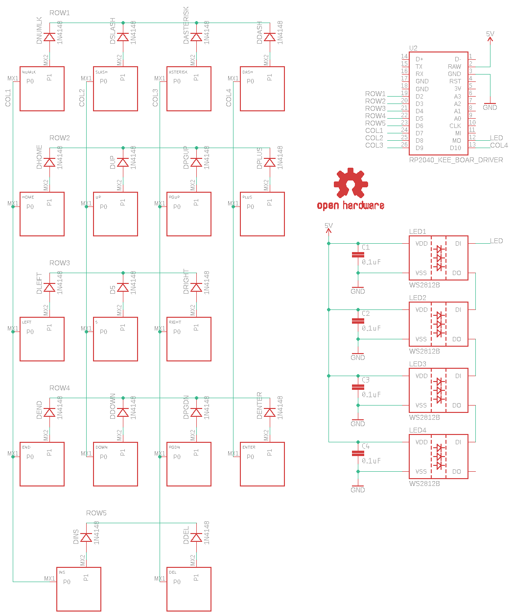
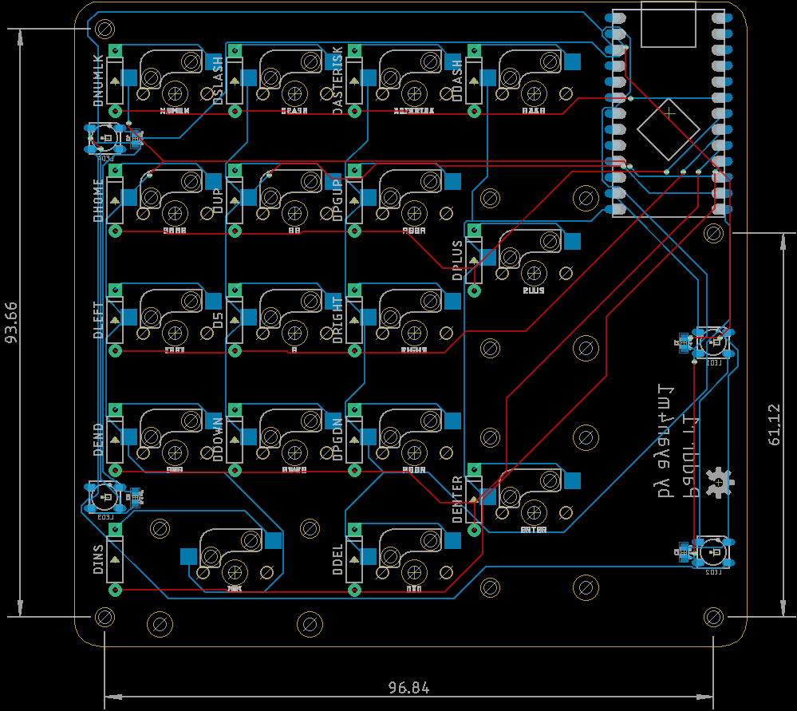

# Paddr

Paddr is a DIY numpad built using [KMK](https://github.com/KMKfw/kmk_firmware). It has four RGB LEDs and seventeen keys.

## Schematic

## Board

## PCB

[OSH Park](https://oshpark.com/shared_projects/GSJlJusC)

## BOM

| Vendor    | Part                                                                                                                                            | Quantity |
| --------- | ----------------------------------------------------------------------------------------------------------------------------------------------- | -------- |
| onsemi    | [1N4148 Diode](https://www.mouser.com/ProductDetail/onsemi-Fairchild/1N4148?qs=i4Fj9T%2FoRm8RMUhj5DeFQg%3D%3D)                                  | 17       |
| Kailh     | [Hotswap Sockets](https://shop.keyboard.io/products/kailh-hotswap-sockets-for-mx-style-keyswitches-x-25)                                        | 17       |
| Adafruit  | [KB2040](https://www.adafruit.com/product/5302)                                                                                                 | 1        |
| Worldsemi | [WS2812B](https://www.adafruit.com/product/1655)                                                                                                | 4        |
| Samsung   | [0.1uF 6.3V Capacitor - 0603](https://www.mouser.com/ProductDetail/Samsung-Electro-Mechanics/CL03A105MQ3CSNH?qs=X6jEic%2FHinBYQpuhNIfduQ%3D%3D) | 4        |

## Assembly

1. Solder the capacitors and LEDs to the bottom of the board.
2. Solder the hotswap sockets to the bottom of the board.
3. Solder the diodes to the top of the board.
4. Solder the KB2040 to the bottom of the board.

## Firmware

Copy all files from the firmware directory to the root of the CIRCUITPY drive. The keymap lives in code.py.

After you install the firmware, the CIRCUITPY drive and USB serial port will be hidden on subsequent restarts of the numpad. To override this behavior, hold down the dash key while plugging the numpad in.

To configure the RGB, double tap the zero key, then tap one of the following buttons:

| Key      | RGB Function   |
| -------- | -------------- |
| 8        | Value Increase |
| 2        | Value Decrease |
| 4        | Hue Decrease   |
| 6        | Hue Increase   |
| NumLk    | Mode - Solid   |
| Slash    | Mode - Breathe |
| Asterisk | Mode - Rainbow |
| Dash     | Mode - Swirl   |
